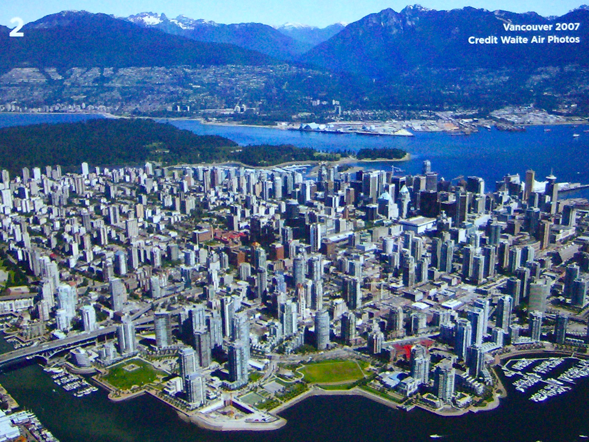
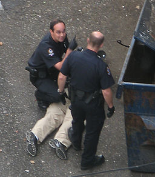

## Data Science Immersive Capstone Project - Crime Prediction in Vancouver, Canada
This project predicts spikes in crime rates by neighborhood in Vancouver, BC, Canada. The goal is to proactively reduce criminal activity through targeted police prevention and intervention tactics.

 

## Problem definition
 Vancouver is routinely rated one of the world's most livable cities ([ref](https://biv.com/article/2017/08/vancouver-third-most-livable-city-world-economist)). However, the city has some of the highest illegal drug consumption rates in North America ([ref](https://en.wikipedia.org/wiki/Downtown_Eastside)).

 

As a result, the crime rate is high by Canadian standards ([ref](https://globalnews.ca/news/4064656/bc-crime-justice-system-report/)). The objective of this predictive model is to aid planning departments in the allocation of resources, such as police and emergency services.

The Vancouver police ran a six-month pilot program in 2016 that attempted to predict property crimes by neighborhood. This led to a significant drop in property crime rates  ([ref](http://mediareleases.vpd.ca/2017/07/21/vancouver-police-adopt-new-technology-to-predict-property-crime/)) and has since been adopted as an ongoing police tactic. The public can access past data, but does not have access to the results of the predictive model.

This capstone project will attempt to improve on the previous model, considering additional factors such as street drug prices, drug use rate, weather, and dates of social service payments (more to be determined). Non-property based crimes will also be included in this analysis, and a prediction model will be built with this data.

 

## Data collection, processing, and storage

Data will be collected from the Vancouver Police Department's crime database (560,000 crimes)
([ref](http://data.vancouver.ca/datacatalogue/crime-data.htm)), the United Nations report on street drug prices (request submitted for direct access, web-scraping if denied), weather forecasts, and publicly available calendars of events (more to be determined).

Once the predictive model is built, it will be hosted on a web app. Users will be able to input a date, and a predicted crime rate by category will be given for each neighborhood of Vancouver. This model will be updated weekly as the Vancouver Police Department publishes their weekly crime report. This process will run through an EC2 instance on Amazon Web Services.

 

## Potential problems

1) I especially want to study the correlation between crime and street drug prices. If the UN won't authorize the data use, web scraping could be slow.

2) The model might not be predictive of non-property crime, leading to a less impressive result.

3) If publicly available, the model could become a tool for criminals. Access might have to be restricted to government officials.

Note that Vancouver has disadvantaged neighborhoods, but they are not racially homogeneous. Therefore, I am confident that this tool will not be used for racial profiling.
