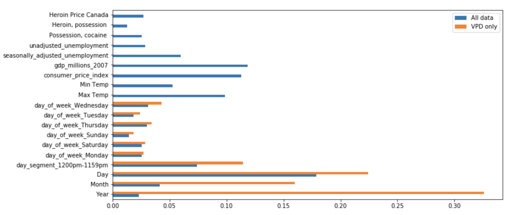

## Galvanize Data Science Immersive Capstone Project  
 
## Property Crime Prediction by Neighborhood in Vancouver, BC, Canada

This project predicts the number of property crimes by neighborhood in Vancouver, BC, Canada. The goal is to proactively reduce criminal activity through targeted police prevention and intervention tactics.

 

## Overview
 Vancouver is routinely rated one of the world's most livable cities ([ref](https://biv.com/article/2017/08/vancouver-third-most-livable-city-world-economist)). However, the city has some of the highest illegal drug consumption rates in North America ([ref](https://en.wikipedia.org/wiki/Downtown_Eastside)).

 

As a result, the crime rate is high by Canadian standards ([ref](https://globalnews.ca/news/4064656/bc-crime-justice-system-report/)). The objective of this predictive model is to aid planning departments in the allocation of resources, such as police and emergency services.

The Vancouver Police Department (VPD) ran a six-month pilot program in 2016 that attempted to predict property crimes by neighborhood. This led to a significant drop in property crime rates  ([ref](http://mediareleases.vpd.ca/2017/07/21/vancouver-police-adopt-new-technology-to-predict-property-crime/)) and has since been adopted as an ongoing police tactic. However, the VPD does not publish its methodology.

This capstone project will be submitted to the VPD upon completion, in an attempt to improve on the previous model. The property crime data published by the VPD will be considered along with data from addtional sources, including illegal drug prices, number of arrests for possession of heroin and cocaine, weather data, and economic data.

My interest in this project is derived from my love of my hometown. It is a wonderful city and beloved by many. However, it is scarred by its drug problem and the inherent property crimes that come with drug addiction. The area with the worst difficulties is locally known as the Downtown Eastside but the VPD refers to it as the Central Business District. ([ref](https://www.vice.com/en_ca/article/nev4p8/why-vancouver-has-always-been-an-addiction-ground-zero))

Many different approaches are being tried to attempt to alleviate this problem. ([ref](http://www.cbc.ca/radio/ondrugs/city-on-drugs-the-dark-pull-of-vancouver-s-downtown-eastside-1.4229455)) My hope is that if property crime is reduced, the general population will have more sympathy for the addicted.

Note that Vancouver has disadvantaged neighborhoods, but they are not racially homogeneous. Therefore, I am confident that this tool will not be used for racial profiling.

 

## Datasets

* The primary data is collected weekly from the Vancouver Police Department's crime database (491,459 property related crimes from 2003 to 2017). ([ref](http://data.vancouver.ca/datacatalogue/crime-data.htm))
* Climate data is collected daily from the (US) National Weather Service, with Bellingham airport in Washington acting as a substitute for Vancouver weather. The two cities are 50 miles apart and have very similar climates. (This will be changed to Vancouver specific data in future.) ([ref](https://www.weather.gov/help-past-weather))
* Data pertaining to the number of arrests for possession of heroin and cocaine and economic data, such as unemployment rates, the consumer price index, and the gross national product, are taken from Statistics Canada, Data BC and Vancouver Open Data. ([ref](http://www5.statcan.gc.ca/researchers-chercheurs/index.action?lang=eng&univ=7&search=&start=1&end=25&sort=0&themeId=0&date=&series=&author=&themeState=-1&dateState=-1&seriesState=-1&authorState=-1&showAll=false))  
* Data on the price of wholesale heroin is taken from United Nations Office on Drugs and Crime.

The information that follows might be overly technical for some readers. The slideshow presentation is more accessible if that is preferred.

([Slideshow presentation on youtube]( https://www.youtube.com/watch?v=lE_fU4Ygur4&list=PLxtztEze-DRedrinVPfmde2jq9UKwxBzq&index=10))

 

## Methodology

Various feature engineering methods were applied to the data and each variation was tested as outline below. These involved various divisions of the neighborhoods, and also breaking the day into segments.

Two different day segmentations were considered in each model:
* 1200am-759am, 800am-359pm, 4pm-1159pm
* 1200am-1159am, 1200pm-1159pm

Neighborhoods were divided in two different ways due to differing crime rates. All models were trained on each subgroup individually:

* Division of the neighborhoods into low crime rate, medium crime rate, and high crime rate subgroups.
* Division of the neighborhoods into a subgroup containing only the  Central Business District and  another subgroup containing all other neighborhoods.

Many machine learning methods were applied to these various setups and the results were recorded.

Methods used to perform regression:

* Lasso  
* Random forest
* Adaptive boosting
* Neural networks
* Extreme gradient boosting

The best results were obtained by using the 1200am-1159am, 1200pm-1159pm day segmentation, which matches the shift hours of the Vancouver Police Department. It was also optimal to divide the neighborhoods into one subgroup containing only the  Central Business District and  another subgroup containing all other neighborhoods. Due to differing crime rates, separate models were trained on each subgroup of neighborhoods.

Of all the models constructed, the best results were achieved using one of the Sci-kit Learn neural network model packages. However, this model was not chosen as it is a "black box" model. That is, determining the importance of certain data features is difficult when using this model. Feature importance can be determined using variable subset selection but this is computationally expensive.

The model that used extreme gradient boosting came in a close second in all of the metrics used and has a measure of feature importance built in to the associated machine learning package. As a result, this was my model of choice for this project.

 

## Analysis of results

The models were evaluated using several metrics.
* R-squared score (R2)- explains the percentage of variance in the target variable explained by the model
* Mean average error (MAE)- a measurement of error of the model, less affected by outliers (large errors)
* Root Mean square error (RMSE)- a measurement of error of the model, more affected by outliers (large errors)

The first train and test setup involved the usual train-test-split on all of the data. 70% of the data was randomly chosen for the training set and the other 30% of the data was used for the test set. The results are given.

Central Business District (10.62 crimes expected in a given 12 hour day segment)
* R2 = 0.443796496866
* MAE = 3.00336262749
* RMSE = 3.86116934581

All other neighborhoods (2.43 crimes expected in a given 12 hour day segment)
* R2 = 0.303793264968
* MAE = 1.10269428461
* RMSE = 1.53165706421

The second train and test setup involved training the model on the data from 2003 to 2016 and using the data from 2017 as the test set.

Central Business District (10.62 crimes expected in a given 12 hour day segment)
* R2=0.325395926483
* MAE=3.57703058948
* RMSE=4.62383884462

All other neighborhoods (2.43 crimes expected in a given 12 hour day segment)
* R2 = 0.271621152143
* MAE = 1.06448260918
* RMSE = 1.45063549814

 

## Comparison to a less engineered dataset

In both setups, the model was fairly predictive for the high crime Central Business District (10.62 property crimes per day segment on average), and less so in the other neighborhoods. This was to be expected as these neighborhoods are relatively low crime areas to begin with (2.43 property crimes per day segment on average) and the number of crimes is a discrete measure. In both cases, however, the R2 scores were predictive, which supports the validity of the model.

One of the concerns that must be considered when working with compiled datasets and machine learning algorithms is whether the added data actually had a predictive effect. To examine this, I constructed a similar model trained on a minimal dataset. This dataset consisted solely of the Vancouver Police Department data with some basic feature engineering.

* Day of week added
* Same day segmentation as my model
* Same neighborhood segmentation as my model

The train and test setup involved the same train-test-split (70/30) on all of the data. The results are given.

Central Business District (10.62 crimes expected in a given 12 hour day segment)
* R2 = 0.433509761701
* MAE = 2.97317258664
* RMSE = 3.82057882326                

All other neighborhoods (2.43 crimes expected in a given 12 hour day segment)
* R2 = 0.226077337043
* MAE = 1.15953749966
* RMSE = 1.60176260601

It was initially a concern to note that the metrics were very similar with or without the new data being considered. This might imply that the added data was unnecessary. However, the feature importance varied greatly between the models, particularly in the high crime Central Business District (see the graph below). In the Central Business District, using the model with extra data, the initial VPD data features were not ranked very highly in importance relative to the features from the added data.
 

 
It can be seen in the graph that the new data features are ranked as predictive by the new model. I suspect that the date data and the economic data are correlated but economic data is arguably more informative in general. As expected, the drug related data seems to be predictive. However, thepredictive nature of the temperature data was a surprise, as Vancouver's weather doesn't vary that much.

These feature importance metrics imply that there may be significant predictive gains to be made with further investigation. Moreover, it seems like there is a better chance of further improvements with the extra datasets added to the model.

 

## Conclusions

* The model constructed was predictive in general but much more predictive in the Central Business District. As this is where most of the crime occurs, the model may have significant value to the Vancouver Police Department.

* This data should be examined using time series forecasting. This may provide further insight and hopefully increase the predictive power of the model.

* The Central Business District should be subdivided and examined further. This is possible as the VPD data gives street, hundred block, latitude and longitude data.

* Data should be added or refined to the model inputs (see improvements and extensions below)

 

## Delivery of predictions

The predictive model is demonstrated on a web page that is updated daily. Users choose one of three maps, one for each of the following three days. They are then able to click on any of Vancouver's 24 neighborhoods (shown on a map), and a predicted property crime rate will be given for that neighborhood for that three days. In addition, a data table is presented below the interactive map with that day's predicted property crime rates for all neighborhoods.
 

 

This model is updated daily as weather data proved to be predictive. The Vancouver Police Department publishes their crime report weekly on Sunday while most of the other data is updated monthly. This process is currently run locally but will be set up to run through an EC2 instance on Amazon Web Services.
 

## Extensions and improvements

* Examine the predictive model using time series data analysis.

* Set up the EC2 instance to update automatically.

* The Central Business District has a uniquely high crime rate, hence has been considered separately in the predictive model. However, the Vancouver Police Department releases the hundred block and street, as well as the latitude and the longitude, of each incident. Build a separate predictive model for this neighborhood that predicts by city block.

* The illegal drug possession data currently being used is annually for British Columbia (BC) as a whole. A request has been made to the BC government for monthly data specific to Vancouver.

* The price of wholesale heroin given is given yearly and for Canada as a whole. Monthly and/or Vancouver specific data would be preferable. A request has been made to the United Nations Office on Drugs and Crime for this information.

* The weather data used is from the (US) National Weather Service for Bellingham airport in Washington. A web-scraping tool will be built to scrape equivalent data for Vancouver, Canada.
 

## Toolkit

* Jupyter Notebook - integrated development environment for python; used to explore data and test code
* Pandas - provides high-performance, easy-to-use data structures and data analysis tools for Python; used for basic data manipulation & some file reading
* NumPy - the fundamental package for scientific computing with Python; used for math functionality
* Sci-kit learn - data modeling library
* XGBoost - scalable machine learning system for boosting
* Datetime - a python library for time related functions
* Matplotlib - math plotting library for python
* Seaborn - statistical data visualization library for python
* MongoDB - a NoSQL database; will be used for storing information for the web page
* Pymongo - a python wrapper for MongoDB

 
